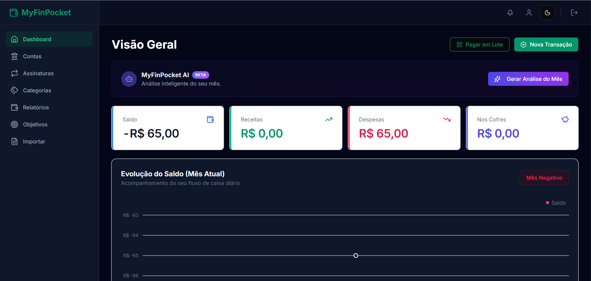
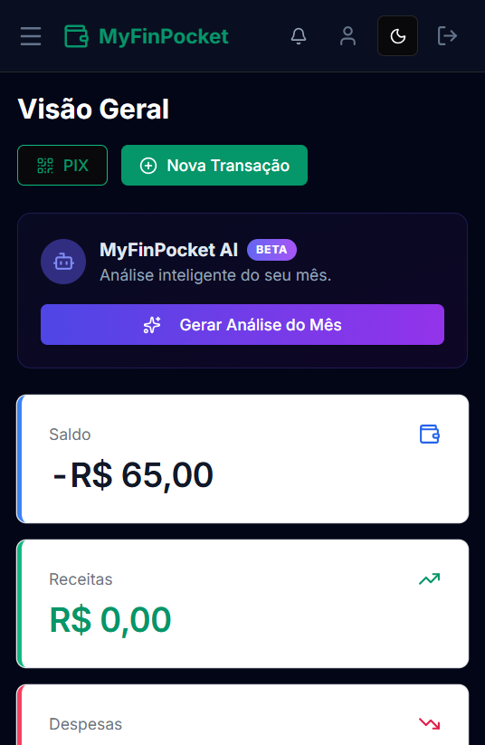

<h1 align="center">💼 MyFinPocket</h1>

<p align="center">
  Aplicação de finanças pessoais para registrar receitas e despesas, acompanhar o saldo e entender para onde vai o dinheiro.
</p>

<p align="center">
  <a href="https://my-finpocket.vercel.app/"><strong>Acessar a aplicação »</strong></a>
</p>

<p align="center">
  <a href="https://github.com/devpedroeduardo/my-finpocket/actions/workflows/ci.yml"></a>
  
  
  
  
  
</p>

<p align="center">
  
  &nbsp;
  
</p>

## ✨ Funcionalidades

- **Dashboard do mês** com saldo, receitas, despesas, valor guardado em cofres e gráfico da evolução diária do saldo.
- **Transações** com criação, edição, filtros por tipo, status e período, e busca. Os filtros ficam na URL, então a página pode ser compartilhada ou recarregada sem perder o estado.
- **Contas, categorias e assinaturas** para organizar de onde sai e para onde vai cada valor.
- **Objetivos (cofres) e limites por categoria**, com barras de progresso.
- **Relatórios** com a evolução de receitas e despesas nos últimos 6 meses e exportação em PDF.
- **Leitura de comprovantes com IA:** envie a foto de uma nota ou recibo e o Google Gemini preenche descrição, valor, data e categoria.
- **Análise do mês com IA:** um resumo dos hábitos de gasto com sugestões de onde economizar.
- **Pagamento em lote via PIX:** selecione várias contas pendentes, gere um QR Code PIX e dê baixa em todas de uma vez.
- **PWA instalável**, com tema claro e escuro e layout pensado para o celular.

## 🔒 Destaques técnicos

**Segurança**
- Autenticação com Supabase Auth via cookies, usando `@supabase/ssr` para manter a sessão no servidor.
- Todas as rotas privadas passam pelo `proxy.ts` (middleware do Next.js), que redireciona para o login quem não está autenticado.
- **Row Level Security (RLS)** no PostgreSQL: cada usuário só lê e altera as próprias linhas, regra garantida pelo banco e não só pelo front-end.
- Formulários validados com **Zod** e React Hook Form.

**Qualidade**
- Testes unitários com **Jest** e **React Testing Library** (componentes e formatação de moeda).
- Testes E2E com **Playwright**: carregamento do login, erro com credenciais inválidas, bloqueio de acesso sem login e layout mobile.
- Os testes E2E rodam no **GitHub Actions** a cada push e pull request na `main`.

**Arquitetura**
- Next.js com App Router e **Server Actions** para as operações de dados (`src/app/actions`).
- Regras de consulta isoladas em `src/services` (dashboard e relatórios).
- Componentes de interface com **shadcn/ui** e gráficos com **Tremor** e **Recharts**.

## 🛠️ Stack

| Camada | Tecnologias |
|---|---|
| Front-end | Next.js (App Router), React, TypeScript, Tailwind CSS, shadcn/ui, Framer Motion |
| Back-end | Next.js Server Actions e Route Handlers, Supabase (PostgreSQL + Auth) |
| Validação | Zod, React Hook Form |
| Gráficos e PDF | Tremor, Recharts, jsPDF |
| IA | Google Gemini (`@google/generative-ai`) |
| Testes | Jest, React Testing Library, Playwright |
| CI | GitHub Actions |

## 📁 Estrutura

```
src/
├── app/
│   ├── (dashboard)/     # visão geral
│   ├── actions/         # Server Actions: transações, contas, metas, IA...
│   ├── api/pix/         # baixa em lote via PIX
│   └── reports, goals, wallets, categories, subscriptions, import, profile
├── components/          # componentes da aplicação e ui/ (shadcn)
├── lib/supabase/        # clientes do Supabase para browser, servidor e middleware
├── services/            # consultas do dashboard e dos relatórios
└── proxy.ts             # proteção das rotas
tests/                   # testes E2E (Playwright)
__tests__/               # testes unitários (Jest)
```

## 🚀 Como rodar localmente

**Pré-requisitos:** Node.js 20+ e um projeto no [Supabase](https://supabase.com/).

```bash
git clone https://github.com/devpedroeduardo/my-finpocket.git
cd my-finpocket
npm install
```

Crie um arquivo `.env.local` na raiz:

```env
NEXT_PUBLIC_SUPABASE_URL=sua_url_do_supabase
NEXT_PUBLIC_SUPABASE_ANON_KEY=sua_chave_anonima
SUPABASE_SERVICE_ROLE_KEY=sua_chave_service_role
GEMINI_API_KEY=sua_chave_do_gemini
```

No Supabase, crie as tabelas `transactions`, `wallets`, `goals` e `budgets` vinculadas ao `user_id` e ative políticas de RLS que liberem acesso apenas quando `auth.uid() = user_id`.

```bash
npm run dev
```

A aplicação abre em http://localhost:3000. Para testar a instalação como PWA, use a build de produção (`npm run build` e `npm run start`).

## 🧪 Testes

```bash
npm test                              # testes unitários (Jest)
npx playwright install --with-deps    # primeira vez apenas
npx playwright test                   # testes E2E
```

## 🛣️ Próximos passos

- [ ] Importação e conciliação de extratos bancários automatizada com n8n

## 👨‍💻 Autor

**Pedro Eduardo** · [LinkedIn](https://www.linkedin.com/in/devpedroeduardo/) · [GitHub](https://github.com/devpedroeduardo)
